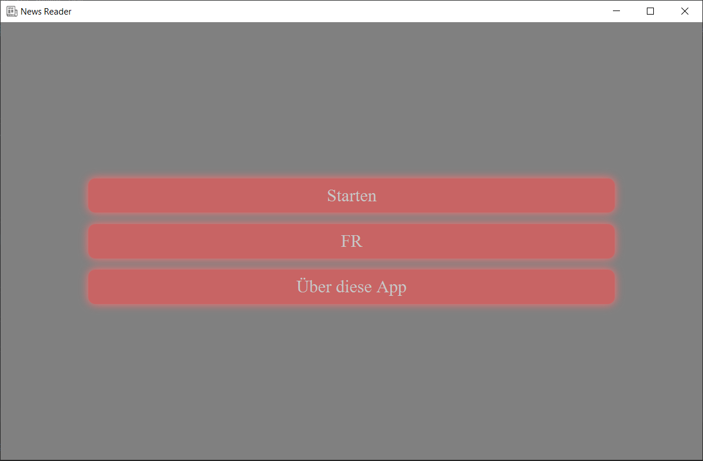
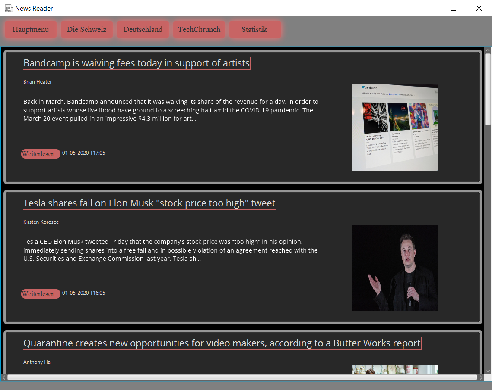

# News_Reader for (Project and Training 2)
## Requirments
Implement a JavaFX/TornadoFX GUI App that displays the newest messages from at least 2 different News Providers.
The news messages are read using a JSON based API and displayed in a table in a user-friendly way. The news are retrieved online when the App is started and can be refreshed optionally.
Two charts containing statistics about the news messages (number per timeframe, number per category, and more) are generated from the retrieved news messages.
The application should use a correct MVC-Pattern. The view should be described with FXML. The UI should be internationalized (at least 2 languages are supported).
Implement a correct exception handling.

## News Provider APIs
- NewsAPI - a JSON API for live news and blog articles (https://newsapi.org/)

## Screenshots of the Application

